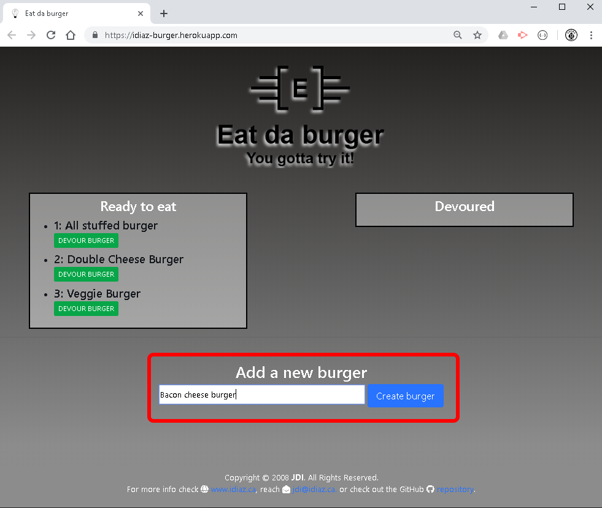
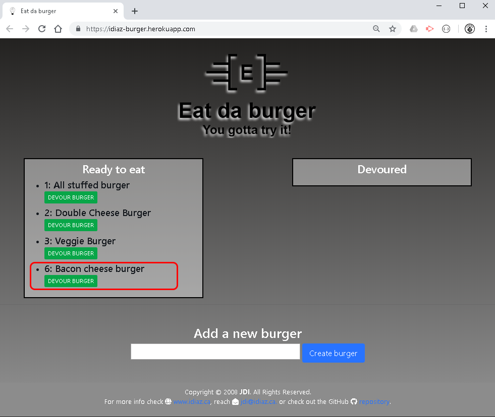
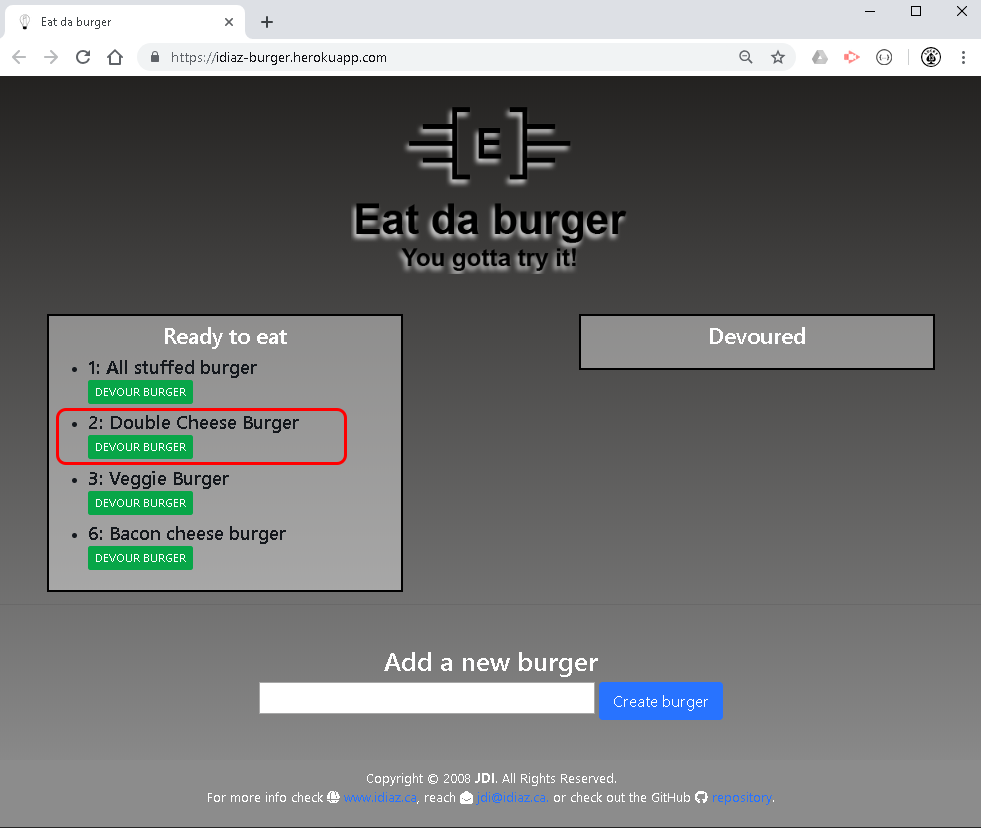
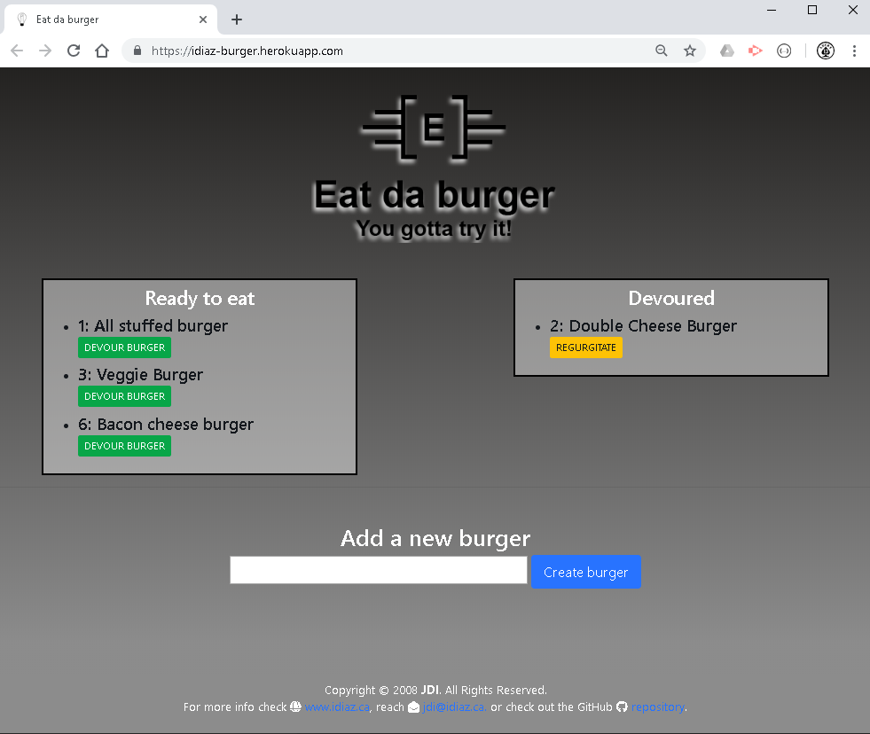

# Burger logger
> **Cretaed by:**     Juan I Diaz (jdi@idiaz.ca)

> **Date:**           March 2019

## DESCRIPTION
This **FULL STACK** project is a burger logger with MySQL, Node, Express, Handlebars and a homemade ORM. This application allow the user to create a burger with any name, this new burger will be shown on a list on the left side of the screen. Then the user can click on a button to "Devour" the burger, thus moving it to the right column.

The app, while looking very silly and simple uses SQL commands to handle the creation and management of the items.... Bon Appétit!!

## INSTRUCTIONS
- This project has been deployed to Heroku, please enter to access https://idiaz-burger.herokuapp.com/ to see the project.

1. Once on the home page you will see any burger that has been created. All burgers ready to be eaten are in the left "Ready to eat" column; all burgers already aten are in the right "Devoured" column.
2. To create a new burger enter its name into the text field underneath the columns and click `Create burger`.
3. All new burgers go to the left column.
4. To devour (eat) your burger, or any other you want, just click the `DEVOUR BURGER` under its name... this burger will move to the righ tcolumn.
5. If you want to return the burger to the left column you can click the `REGURGITATE` button. (I know! I'ts kinda' gross but it's just to allow items to go to their initial state).

## SCREENSHOTS
`Home page` - You can see the current burgers ready to be devoured.

`Adding a new burger` - Enter the name of the burger you want and click *Create burger*.

`New burger is added` to the left column... now to devour it click the *DEVOUR BURGER* button.

`Eat (devour)` your burger of choice.

`Devoured burger` is on the right column. To return it to the left column click *REGUTGITATE*.

## BUILDING TOOLS
- FRONT END
    - HTML, CSS
    - Javascript and jQuery
    - Bootstrap

- BACK END
    - node.js
    - Express
    - ORM
    - MySQL / JawsDB MySQL
    - Handlebars

- Deployment
    - Heroku

## QUESTIONS OR COMMENTS
- Feel free to contact the developer @ <jdi@idiaz.ca>!
- See the **depolyed** project [live](https://idiaz-burger.herokuapp.com/).